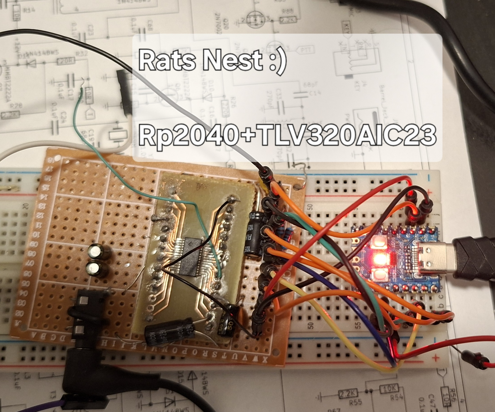

# USB Audio Stereo SDR with WM8731 Codec

This project implements a USB Audio Class 2.0 (UAC2) stereo audio interface with CDC (serial) support for Software Defined Radio (SDR) applications using the Raspberry Pi Pico (RP2040) and WM8731 audio codec.

## Features

- **Stereo Audio**: 2-channel I/Q audio input and output for SDR applications
- **USB Audio Class 2.0**: Compatible with Linux, macOS, and Windows (with drivers)
- **WM8731 Codec**: Professional audio codec with I2S interface
- **Sample Rate**: Fixed 48kHz
- **Bit Depth**: 24-bit audio
- **CDC Serial Port**: Debug/control interface
- **DMA Transfers**: Non-blocking audio transfers for low latency
- **Volume Control**: USB volume and mute controls
- **LED Indicators**: Visual feedback for connection and streaming status

## Hardware Requirements



### RP2040 Board
- Raspberry Pi Pico or compatible RP2040 board

### WM8731 Audio Codec Module
- WM8731 I2S audio codec breakout board

### Connections

| RP2040 GPIO | Function | WM8731 Pin | Description |
|-------------|----------|------------|-------------|
| GP0 | I2C0 SDA | SDA | I2C Data |
| GP1 | I2C0 SCL | SCL | I2C Clock |
| GP6 | PWM (MCLK) | MCLK | Master Clock (~12.000 MHz) |
| GP3 | PIO (BCLK) | BCLK | Bit Clock |
| GP4 | PIO (LRCK) | LRCLK/WS | Left/Right Word Select |
| GP5 | PIO (SDO) | DACDAT | DAC Data (RP2040 → WM8731) |
| GP2 | PIO (SDI) | ADCDAT | ADC Data (WM8731 → RP2040) |
| 3.3V | Power | VDD | Power Supply |
| GND | Ground | GND | Ground |

**Note**: Some WM8731 boards require separate AVDD and DVDD connections - connect both to 3.3V.

## Software Requirements

### Build Tools
- CMake (3.13 or later)
- ARM GCC toolchain
- Pico SDK

### TinyUSB
This project uses TinyUSB for USB functionality. Make sure your Pico SDK includes TinyUSB.

## Configuration

### Audio Configuration (tusb_config.h)

Key settings for stereo operation:

```c
#define CFG_TUD_AUDIO_FUNC_1_N_CHANNELS_TX    2  // Stereo microphone (I/Q input)
#define CFG_TUD_AUDIO_FUNC_1_N_CHANNELS_RX    2  // Stereo speaker (I/Q output)
#define CFG_TUD_AUDIO_FUNC_1_MAX_SAMPLE_RATE  48000  // Maximum sample rate
```

### WM8731 Configuration (wm8731.h)

GPIO pin assignments can be customized:

```c
#define WM8731_I2C_SDA_PIN      0
#define WM8731_I2C_SCL_PIN      1
#define WM8731_SDI_PIN          2
#define WM8731_BCLK_PIN         3
#define WM8731_LRCK_PIN         4
#define WM8731_SDO_PIN          5
#define WM8731_MCLK_PIN         6
```

DMA buffer size (affects latency):

```c
#define WM8731_DMA_BUFFER_SIZE  512  // Samples per channel per buffer
```

## Building

1. **Set up Pico SDK**:
```bash
export PICO_SDK_PATH=/path/to/pico-sdk
```

2. **Create build directory**:
```bash
mkdir build
cd build
```

3. **Configure and build**:
```bash
cmake ..
make
```

4. **Flash to Pico**:
- Hold BOOTSEL button while plugging in USB
- Copy `usb_audio_sdr.uf2` to the RPI-RP2 drive

## Usage

### Linux

The device should be automatically recognized:

```bash
# List audio devices
arecord -l
aplay -l

# Record stereo I/Q data
arecord -D hw:CARD=SDRAudio,DEV=0 -f S16_LE -r 48000 -c 2 output.wav

# Play stereo I/Q data
aplay -D hw:CARD=SDRAudio,DEV=0 -f S16_LE -r 48000 -c 2 input.wav
```

### With GNU Radio

The stereo audio device can be used directly with GNU Radio:

1. Use "Audio Source" block for ADC (receiving)
   - Device: Select the SDR Audio device
   - Sample rate: 48000
   - Channels: 2

2. Use "Audio Sink" block for DAC (transmitting)
   - Device: Select the SDR Audio device
   - Sample rate: 48000
   - Channels: 2

The two channels represent I and Q components for SDR applications.

### macOS

```bash
# List devices
system_profiler SPAudioDataType

# Use with audio applications or command line
afplay -d "SDR Audio" input.wav
```

### Windows

Windows requires a driver for UAC2 devices on versions before Windows 10. Windows 10 and later support UAC2 natively.

## LED Status Indicators

- **Slow blink (1s)**: USB connected, not streaming
- **Fast blink (25ms)**: Audio streaming active
- **Medium blink (250ms)**: USB not connected
- **Very slow blink (2.5s)**: USB suspended

## Troubleshooting

### Device not detected
1. Check USB connection
2. Verify power supply (stable 3.3V required)
3. Check serial output for initialization messages

### No audio
1. Verify WM8731 connections (especially I2C and I2S pins)
2. Check MCLK signal with oscilloscope (~12.288 MHz)
3. Verify codec initialization via serial debug output
4. Check volume settings (not muted)

### Audio distortion
1. Check power supply quality (codec is sensitive to noise)
2. Verify DMA buffer size is appropriate
3. Check for USB bandwidth issues
4. Ensure proper grounding

### I2C Communication failure
1. Verify pull-up resistors on I2C lines (typically 4.7kΩ)
2. Check I2C address (0x1A or 0x1B depending on CSB pin)
3. Verify 3.3V power to codec

## Technical Details

### USB Audio Format
- **Format**: PCM (Pulse Code Modulation)
- **Bit depth**: 16-bit or 24-bit (in 32-bit slots)
- **Sample rates**: 44.1kHz, 48kHz, 96kHz
- **Channels**: 2 (stereo)
- **Endpoint**: Isochronous adaptive (speaker), asynchronous (microphone)

### Audio Data Flow

```
USB Host (PC)                    RP2040                    WM8731 Codec
                                                           
RX (Speaker/DAC):
[I/Q Data] --USB--> [DMA Buffer] --I2S PIO--> [DAC] --> Analog Out

TX (Microphone/ADC):
Analog In --> [ADC] --I2S PIO--> [DMA Buffer] --USB--> [I/Q Data]
```

### Memory Usage
- USB buffers: ~8-32 KB (depending on configuration)
- WM8731 DMA buffers: ~4 KB (2 buffers × 512 samples × 2 channels × 2 bytes)
- Code: ~40 KB

## Advanced Configuration

### Changing Sample Rate

Edit `uac2_app.c`:

```c
const uint32_t sample_rates[] = {44100, 48000, 96000};
uint32_t current_sample_rate  = 48000;  // Default
```

### Custom I2S PIO Programs

The I2S interface uses PIO (Programmable I/O). You can modify `i2s.pio` for:
- Different bit depths
- Different formats (MSB-first, LSB-first, etc.)
- Custom timing requirements

### Adjusting Latency

Reduce DMA buffer size for lower latency (at the cost of CPU usage):

```c
#define WM8731_DMA_BUFFER_SIZE  256  // Lower latency
```

Increase for higher efficiency (higher latency):

```c
#define WM8731_DMA_BUFFER_SIZE  1024  // Higher latency
```

## License

MIT License - See individual source files for copyright information.

## Credits

- Based on TinyUSB UAC2 examples
- WM8731 codec driver adapted for RP2040
- Original UAC2 headset example by Jerzy Kasenberg and Angel Molina

## References

- [WM8731 Datasheet](https://www.cirrus.com/products/wm8731/)
- [USB Audio Class 2.0 Specification](https://www.usb.org/document-library/audio-device-class-20)
- [TinyUSB Documentation](https://docs.tinyusb.org/)
- [RP2040 Datasheet](https://datasheets.raspberrypi.com/rp2040/rp2040-datasheet.pdf)
